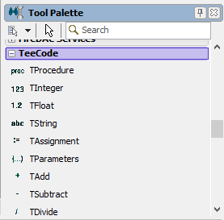
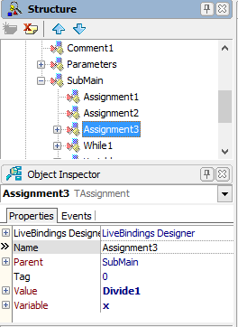
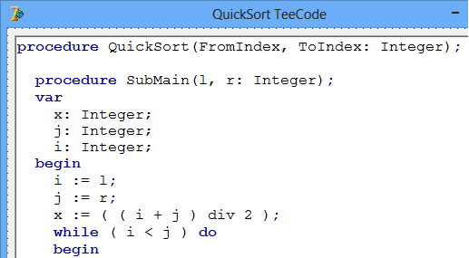
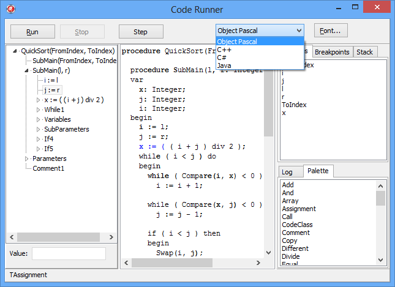

TeeCode
=======

TeeCode is a new kind of component-based programming language, <b>just for fun</b> !

Remember ! This is an "Experiment Pet Project", probably not useful to anybody ! :-)

Data types and code instructions are represented by normal Component classes (TWhile, TIf, TFor, TFunction, TVariable, etc) and installed to the ide Tool Palette:

So, they can be placed visually on forms, and interconnect them using properties:

A RichEdit renderer control displays these tree structures into a human-readable language, like Delphi, C# or whatever:

Forms containing TeeCode components can be conceptually devised as Class definitions, so to create an instance you create a form.

By using events, you can inject custom code at any execution step, or at any variable setter or getter, to alter code execution.

Creating derived classes is done by creating inherited forms and then adding or overriding base components.

A Runner component allows execution and simple debugging.

<h3>How to install?</h3>

-Open the Package\TeeCode1.dpk package and install it.

<h3>Demos</h3>

-QuickSort
